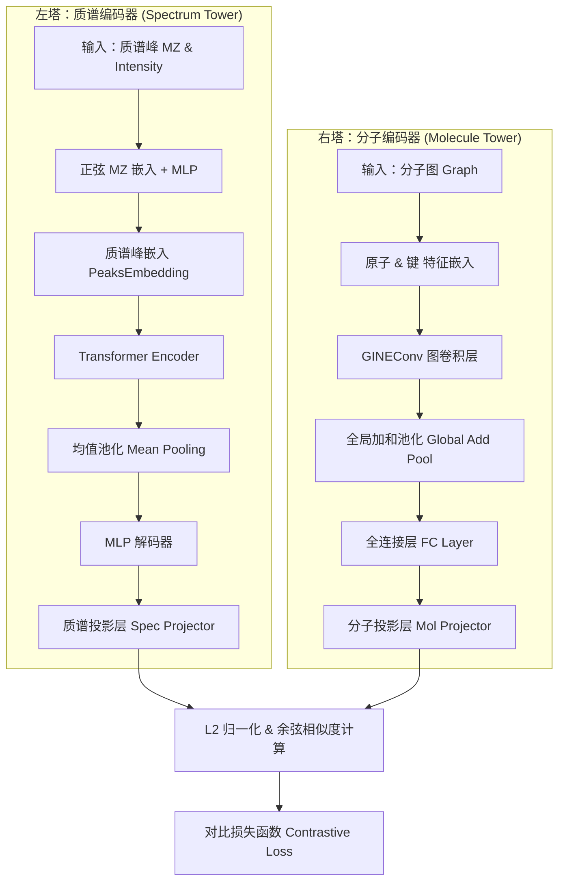

# SpecEmbedding & SpecMolAlign 模型结构示意图

根据对代码库中 `SiameseModel`（质谱编码器）和 `SpecMolAlignModel`（对齐模型）的分析，该模型采用了经典的**双塔对齐架构（Contrastive Learning / CLIP-style）**，将质谱数据和分子结构映射到同一个高维特征空间进行匹配。

## 1. 模型结构图 (Mermaid)

## 2. 结构要点说明

### 2.1 质谱编码器 (SpecEmbedding / SiameseModel)
*   **PeaksEmbedding**: 这是模型的核心输入层。它首先利用正弦/余弦函数对 `m/z`（质荷比）进行位置编码（类似 Transformer 的 Position Encoding），然后将 `m/z` 嵌入与强度（Intensity）拼接，通过 MLP 得到每个峰的向量表示。
*   **Transformer Encoder**: 利用多头注意力机制捕获质谱中不同碎片峰之间的相互关系。
*   **池化与解码**: 通过对所有有效峰的 Embedding 进行均值池化（Mean Pooling），将变长的峰序列压缩为固定长度的特征向量，最后由 MLP 解码器输出质谱指纹。

### 2.2 分子编码器 (GINEEncoder)
*   **图神经网络**: 采用 **GINE (Graph Isomorphism Network with Edge features)**，这是一种改进的图同构网络，能够同时考虑原子（节点）和化学键（边）的特征。
*   **全局池化**: 将整个分子图的所有节点信息通过 `global_add_pool` 汇总，形成分子的全局表征向量。

### 2.3 对齐机制 (SpecMolAlignModel)
*   **共享表征空间**: 两个塔的输出分别通过各自的线性投影层（Projector），映射到统一的投影维度（如 512 维）。
*   **归一化与对比**: 对两个塔输出的向量进行 L2 归一化，通过计算余弦相似度并乘以可学习的温度系数（logit_scale）来衡量匹配程度。
*   **训练目标**: 使得匹配的“质谱-分子对”相似度得分最高，在特征空间中距离最近。

## 3. 应用场景
这种双塔结构使得模型非常适合以下任务：
1.  **库检索**: 将查询质谱与已知分子库中的指纹进行相似度比对。
2.  **跨模态学习**: 学习质谱碎片规律与分子亚结构之间的对应关系。
3.  **零样本识别**: 对训练集中未出现的分子进行潜在的质谱匹配。
