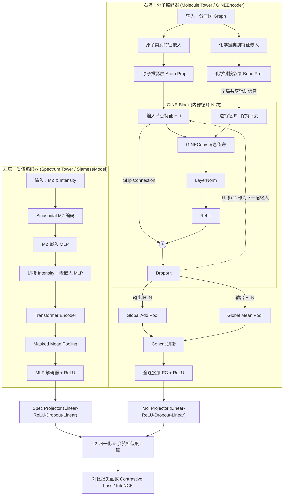

# SpecEmbedding & SpecMolAlign 模型结构说明

本项目的核心是一个跨模态对齐模型，旨在将**质谱数据 (Mass Spectrometry)** 和 **分子结构 (Molecular Structure)** 映射到同一个高维连续向量空间，从而实现质谱检索、分子识别等任务。

## 1. 模型架构图 (Mermaid)

## 2. 核心组件详解

### 2.1 质谱编码器 (SiameseModel)
*   **SinusodialMz**: 将连续的 `m/z` 值转换为正弦/余弦位置编码，使其能够捕捉不同尺度下的碎片特征。
*   **PeaksEmbedding**: 
    1. 首先通过一个 MLP 对 `m/z` 的位置编码进行投影。
    2. 将投影后的 MZ 特征与原始强度 (Intensity) 拼接。
    3. 再次通过一个 MLP 融合两者的信息，得到每个峰的 Embedding。
*   **Transformer Encoder**: 使用标准的多头自注意力机制，对一个光谱内的所有有效峰进行建模，学习碎片之间的关联规律。
*   **Pooling & Decoder**: 通过 `mask` 屏蔽掉填充峰，进行均值池化（Mean Pooling），随后经过一个 MLP 解码器输出质谱的特征向量。

### 2.2 分子编码器 (GINEEncoder)
*   **多维度特征嵌入**: 
    *   **原子特征**: 包括元素符号、度数、隐式氢原子数、芳香性、环信息、形式电荷。
    *   **化学键特征**: 包括键型、是否共轭、是否在环内。
    *   所有类别特征先经过 `nn.Embedding`，再通过各自的 `Proj` 层对齐维度。
*   **GINEConv**: 采用 Graph Isomorphism Network with Edge features。每个卷积层内部包含一个双层 MLP。
*   **训练优化**: 
    *   **残差连接 (Residual Connection)**: `h = norm(conv(h)) + h`。
    *   **层归一化 (LayerNorm)**: 提高深层网络的训练稳定性。
*   **多重池化 (Multiple Pooling)**: 模型采用了一种混合池化策略。将 `global_add_pool` (捕获绝对尺寸/质量分布) 和 `global_mean_pool` (捕获相对结构/平均密度分布) 的结果在特征维度上进行**拼接 (Concat)**，然后通过全连接层进行融合。这既保留了质量等关键先验，又通过尺度不变性缓解了过拟合，大大增强了图表示的表达能力。
### 2.3 投影与对齐 (SpecMolAlignModel)
*   **双塔投影 (Projectors)**: 为了对齐两个模态的维度，两个编码器的输出分别进入一个独立的 MLP 投影层（线性 -> ReLU -> Dropout -> 线性）。
*   **归一化**: 在计算相似度之前，对投影后的向量进行 L2 归一化，将特征映射到单位超球面上。
*   **温度系数 (Tau)**: 引入可学习的倒数温度系数 $1/\tau$，用于在对比学习中调节相似度得分的分布。

## 3. 训练目标
模型通过 **InfoNCE 损失函数** 进行训练，使得同一对“质谱-分子”的余弦相似度最大化，同时最小化与批次内其他非匹配对的相似度。这种方法学习到的嵌入空间具有很好的判别性，支持高效的跨模态检索。
