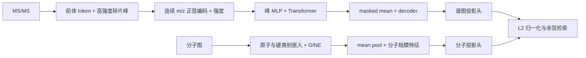

# 编码器与跨模态对齐

本文解释第一阶段实现；第二阶段见 [reranker 说明](docs/reranker_solution_zh.md)。谱图塔继承
SpecEmbedding 的峰序列架构，不能把它计为本文 residual learning-to-rank 的新增贡献。
以下维度是 [params.yaml](params.yaml) 的当前默认值，历史实验以 checkpoint 配置为准。

## 谱图输入与编码

[Tokenizer](SpecEmbedding/data/tokenizer.py) 从 `matchms.Spectrum` 读取 `precursor_mz`、
`smiles` 和谱峰，选择强度最大的 `max_len - 1` 个碎片峰，保留其在原数组中的顺序，并将
选中峰强度除以其中最大值。第 0 位为前体 token，强度为 2；不足长度用 PAD 补齐。
输出 `mz`、`intensity`、`mask` 均为 `[max_len]`，其中 `mask=True` 表示 padding。

[SiameseModel](SpecEmbedding/models.py) 是共享参数的谱图编码器。连续 m/z 经过波长范围
`1e-3` 至 `1e3` 的正弦/余弦编码与 MLP，再与 intensity 拼接，经峰 MLP 送入 Transformer。
padding mask 用于注意力和 mean pooling，池化后由 decoder 输出谱图向量。
这不是离散 m/z 词表，也不是序列位置编码。

## 分子图与 GINE

[graph_utils.py](SpecEmbedding/data/graph_utils.py) 将分子转换为 PyG 图：

| 张量 | 内容 |
| --- | --- |
| `x: [atoms, 6]` | 元素、度数、总氢数、芳香性、环类别、形式电荷 |
| `edge_index: [2, directed_edges]` | 每条无向键展开为两个方向 |
| `edge_attr: [directed_edges, 3]` | 键类型、共轭、是否在环内 |
| `graph_size_features: [2]` | `log1p(原子数)`、`log1p(无向键数)` |

环信息是单一类别：非环、3/4/5/6 元环或其余环；同时属于多个环时按上述顺序取第一个匹配。
形式电荷在 `-2..2` 外分为 `<-2`、`>2`，元素等字段有 unknown 类别；完整取值表以代码为准。

[GINEEncoder](SpecEmbedding/models_align.py) 为每个类别字段单独嵌入：类别数不超过 2 时
使用 4 维，其余为 20 维；拼接后投影到分子隐藏宽度。每层执行归一化、GINEConv、ReLU、
dropout 和残差连接。归一化支持 LayerNorm/RMSNorm，必须与 checkpoint 一致。
图级 mean pooling 与经 MLP 编码的规模特征拼接，再经全连接层和 ReLU 输出。

## 对齐与训练

`SpecMolAlignModel` 为两塔分别设置 `Linear → ReLU → Dropout → Linear` 投影头，映射到
共同空间。`encode_spec` / `encode_mol` 可返回 L2 归一化向量，检索使用归一化点积。
相似度缩放为 `exp(logit_scale).clamp(max=100)`；`logit_scale` 是可学习参数，初始为
`log(1/tau)`，不是固定的 `1/tau`。

| 当前默认配置 | 值 |
| --- | --- |
| token 长度 / 谱图 embedding / 输出维度 | 100 / 512 / 512 |
| 谱图 Transformer 层数 / heads / FFN 宽度 | 4 / 16 / 512 |
| GINE 层数 / 隐藏宽度 / 规模特征宽度 | 4 / 128 / 32 |
| 对齐维度 / 初始 tau | 512 / 0.07 |

[train.py](train.py) 用同一 SMILES 的谱图或增强视图进行监督对比预训练；
[train_align.py](train_align.py) 支持预训练谱图塔或随机初始化：

- 加载预训练谱图塔时，stage 1 冻结该塔，分子塔、投影头和温度参数使用 `10 × lr`；
  stage 2 解冻，谱图塔使用 `lr / 10`，其余使用 `lr`。
- 从零训练时跳过 stage 1，stage 2 两塔、投影头和温度参数均使用 `lr`。

[对齐损失](SpecEmbedding/loss_align.py) 是双向多正例对比损失：batch 内相同分子标签的
所有配对均为正例，各方向平均正例 log probability，再平均两个方向。只有不传标签时才
退化为对角单正例；不能把有重复标签的非对角配对统称为负例。

推理时 [eval_align.py](eval_align.py) 编码测试谱图与候选分子，计算 Recall@K、MRR 和可选
MCES@1。全量分子 embedding 默认保存在 CPU，再分块送到计算设备，以控制 GPU 显存。
运行示例和数据契约见 [运行指南](docs/README_zh.md)。
