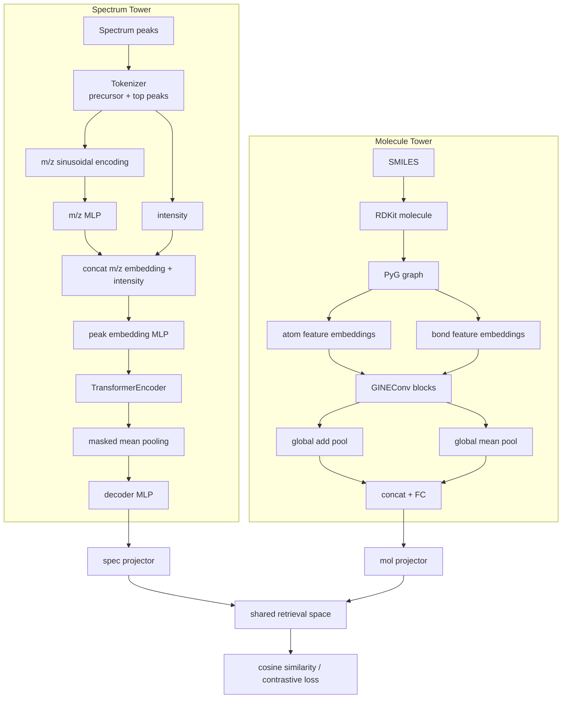

# SpecEmbedding 模型结构说明

本文档基于当前代码实现整理，覆盖三个层次：质谱编码器 `SiameseModel`、分子图编码器 `GINEEncoder`，以及用于跨模态检索的 `SpecMolAlignModel`。相关实现主要位于 `SpecEmbedding/models.py`、`SpecEmbedding/models_align.py`、`SpecEmbedding/data/tokenizer.py`、`SpecEmbedding/data/graph_utils.py`、`train.py` 和 `train_align.py`。

## 1. 总览

项目包含两条训练路径：

1. 质谱表征预训练：只使用 MS/MS 谱图，训练 `SiameseModel`，让同一 SMILES 下的不同谱图或增强视图在嵌入空间中靠近。
2. 谱图-分子跨模态对齐：使用预训练或随机初始化的 `SiameseModel` 作为谱图塔，同时使用 `GINEEncoder` 编码分子图，通过 `SpecMolAlignModel` 将两种模态投影到同一向量空间。

默认配置来自 `params.yaml`：

| 模块 | 默认值 |
|---|---:|
| 谱图 token 长度 | `100` |
| 谱图峰嵌入维度 | `512` |
| Transformer head 数 | `16` |
| Transformer 层数 | `4` |
| 谱图输出维度 | `512` |
| 分子 GINE 隐藏维度 | `128` |
| GINE 层数 | `4` |
| 对齐空间维度 | `512` |
| 对齐温度参数 | `tau = 0.07` |

## 2. 端到端结构图



## 3. 谱图输入与 Tokenizer

`Tokenizer` 将 `matchms.Spectrum` 转换为固定长度序列，输出字段为：

| 字段 | 形状 | 含义 |
|---|---:|---|
| `mz` | `[max_len]` | 峰的 m/z 序列 |
| `intensity` | `[max_len]` | 峰强度序列 |
| `mask` | `[max_len]` | `True` 表示 padding 位置 |
| `smiles` | 标量字符串 | 谱图对应分子 |

处理步骤：

1. 读取 `precursor_mz` 和谱峰数组。
2. 按强度选取前 `max_len - 1` 个峰，再按原 m/z 顺序排列。
3. 将峰强度归一化到最大值为 1。
4. 在序列第 0 位加入 precursor token，其 `mz = precursor_mz`，`intensity = 2`。
5. 不足 `max_len` 的部分使用 `SpecialToken["PAD"]` 补齐，并在 `mask` 中标记。

这个设计让 precursor 信息和碎片峰使用同一个序列建模接口进入 Transformer。

## 4. 谱图编码器 SiameseModel

`SiameseModel` 是项目中的核心谱图编码器。它不是传统意义上两个参数独立的 Siamese tower，而是一个共享参数的谱图编码网络，训练时通过多视图输入和监督对比损失形成 Siamese/contrastive 学习目标。

### 4.1 Peak Embedding

谱图峰由 m/z 和 intensity 两部分组成。

`SinusodialMz` 将连续 m/z 映射到正弦/余弦编码：

```text
mz: [batch, seq_len]
-> sinusoidal m/z embedding: [batch, seq_len, embedding_dim]
```

频率范围由 `LAMBDA_MIN = 1e-3` 到 `LAMBDA_MAX = 1e3` 控制，覆盖不同尺度的 m/z 变化。随后 `SinusodialMzEmbedding` 用 MLP 对正弦编码再投影。

`PeaksEmbedding` 再将 m/z embedding 与 intensity 拼接：

```text
[mz_embedding, intensity] -> MLP -> peak_embedding
```

输出形状为：

```text
[batch, seq_len, embedding_dim]
```

### 4.2 Transformer Encoder

`SiameseModel` 使用 PyTorch `TransformerEncoder`：

```text
TransformerEncoderLayer(
    d_model=512,
    nhead=16,
    dim_feedforward=512,
    batch_first=True,
    norm_first=True,
)
```

`mask` 会作为 `src_key_padding_mask` 传入，padding token 不参与有效注意力计算。

### 4.3 Masked Mean Pooling 与 Decoder

Transformer 输出仍是峰级表示：

```text
[batch, seq_len, embedding_dim]
```

模型用 `mask` 屏蔽 padding 后进行 mean pooling：

```text
sum(valid_peak_embeddings) / num_valid_tokens
```

然后通过 `MultiFeedForwardModule` 解码到 `dim_target`，默认仍为 `512`。最终输出是谱图级向量：

```text
f_spec: [batch, 512]
```

## 5. 分子图表示

`smiles_to_graph` 使用 RDKit 将 SMILES 转成分子图，再封装为 PyTorch Geometric `Data`。

### 5.1 原子特征

每个原子被编码为多个类别特征：

| 特征 | 说明 |
|---|---|
| `symbol` | 元素符号，含 H/C/O/N/P/S/Cl/F/Br/I/Si/B/As/Se/unknown |
| `degree` | 原子度数 |
| `num_hs` | 总氢原子数 |
| `is_aromatic` | 是否芳香 |
| `ring_info` | 不在环内、3/4/5/6 元环、或 7+ |
| `formal_charge` | 形式电荷，范围外归入 `<-2` 或 `>2` |

### 5.2 化学键特征

每条无向键会被展开为两条有向边 `[i, j]` 和 `[j, i]`。边特征包括：

| 特征 | 说明 |
|---|---|
| `bond_type` | 单键、双键、三键、芳香键、unknown |
| `is_conjugated` | 是否共轭 |
| `is_in_ring` | 是否在环内 |

输出图结构：

```text
x:         [num_atoms, num_atom_features]
edge_index:[2, num_edges * 2]
edge_attr: [num_edges * 2, num_bond_features]
```

## 6. 分子编码器 GINEEncoder

`GINEEncoder` 使用带边特征的 GIN 变体 `GINEConv`。

### 6.1 类别特征嵌入

原子特征和键特征都是类别特征。每个字段先独立进入 `nn.Embedding`：

```text
small binary category -> 4 dims
other category        -> 20 dims
```

然后拼接并投影到统一维度：

```text
atom categorical embeddings -> concat -> atom_proj -> emb_dim
bond categorical embeddings -> concat -> bond_proj -> emb_dim
```

默认 `emb_dim = 128`。

### 6.2 GINE Block

每层 GINE block 包含：

1. `GINEConv` 消息传递，内部 MLP 为 `Linear(emb_dim, 2*emb_dim) -> ReLU -> Linear(2*emb_dim, emb_dim)`。
2. `LayerNorm`。
3. `ReLU`。
4. 残差连接。
5. Dropout。

代码中的更新形式为：

```text
h_res = h_node
h_node = GINEConv(h_node, edge_index, edge_attr)
h_node = LayerNorm(h_node)
h_node = ReLU(h_node)
h_node = h_node + h_res
h_node = Dropout(h_node)
```

### 6.3 图级池化

节点表示经过多层 GINE 后，模型同时使用：

```text
global_add_pool(h_node, batch)
global_mean_pool(h_node, batch)
```

两者拼接后经过全连接层：

```text
concat(add_pool, mean_pool) -> Linear(2 * emb_dim, emb_dim) -> ReLU
```

最终输出：

```text
f_mol_base: [batch, 128]
```

## 7. 跨模态对齐模型 SpecMolAlignModel

`SpecMolAlignModel` 是双塔结构：

```text
Spectrum -> SiameseModel -> spec_proj -> f_spec
Molecule -> GINEEncoder  -> mol_proj  -> f_mol
```

两个 projector 结构相同：

```text
Linear(input_dim, hidden_dim)
ReLU
Dropout
Linear(hidden_dim, final_dim)
```

默认维度：

```text
spec encoder output: 512
mol encoder output:  128
hidden_dim:          512
final_dim:           512
```

模型返回：

```text
f_spec, f_mol, 1 / tau
```

其中 `tau` 来自配置，默认 `0.07`。在对齐损失中，`1 / tau` 用于缩放相似度 logits。

## 8. 训练目标

### 8.1 谱图预训练

`train.py` 使用 `TrainDataset` 为每个 SMILES 构造多视图谱图输入：

```text
[batch, n_views, mz/intensity/mask]
```

默认 `n_views = 2`。当启用增强时，增强主要包括：

1. 随机移除低强度峰。
2. 随机扰动峰强度。

训练目标为 `SupConLoss`。同一 SMILES 的样本视为正样本，不同 SMILES 视为负样本。模型学习的是谱图到谱图的判别式 embedding。

### 8.2 谱图-分子对齐训练

`train_align.py` 使用 `AlignGraphDataset`，每个样本同时返回：

```text
spec_mz, spec_intensity, spec_mask, mol_graph
```

分子图可进行结构增强：

1. node dropping。
2. edge masking / dropping。

训练分两阶段：

1. Stage 1：如果提供预训练谱图模型，则冻结 `spec_encoder`，只训练 `mol_encoder` 和两个 projector。
2. Stage 2：解冻所有模块，端到端微调。谱图编码器使用较小学习率 `lr / 10`，分子编码器和 projector 使用 `lr`。

对齐损失位于 `SpecEmbedding/loss_align.py`，是 CLIP 风格双向对比损失：

```text
logits = normalize(f_spec) @ normalize(f_mol).T * logit_scale
loss = (CE(logits, labels) + CE(logits.T, labels)) / 2
```

batch 内对角线为正确谱图-分子配对，其余项为负样本。

## 9. 推理与检索

在 `eval_align.py` 中：

1. 加载 `SpecMolAlignModel` checkpoint。
2. 对测试谱图编码得到 `f_spec`。
3. 对候选分子编码得到 `f_mol`。
4. 对二者做 L2 normalize。
5. 使用 cosine similarity 进行排序，计算 Top-K accuracy、MRR，并可选计算 top-1 MCES。

为了避免大候选集导致 GPU 显存不足，当前评估逻辑支持将全量分子 embedding 存在 CPU，并按 chunk 将候选 embedding 搬到 GPU 计算相似度。

## 10. 关键张量形状

| 阶段 | 张量 | 形状 |
|---|---|---|
| Tokenizer 输出 | `mz` / `intensity` / `mask` | `[max_len]` |
| 谱图 batch | `spec_mz` / `spec_intensity` / `spec_mask` | `[batch, max_len]` |
| 峰嵌入 | peak embedding | `[batch, max_len, 512]` |
| Transformer 输出 | contextual peak embedding | `[batch, max_len, 512]` |
| 谱图向量 | `SiameseModel` output | `[batch, 512]` |
| 分子图节点 | `x` | `[num_atoms, 6]` |
| 分子图边 | `edge_attr` | `[num_directed_edges, 3]` |
| GINE 输出 | molecule embedding | `[batch, 128]` |
| 对齐投影后 | `f_spec`, `f_mol` | `[batch, 512]` |

## 11. 设计要点

1. 谱图侧使用连续 m/z 的正弦编码，避免把 m/z 离散化成固定词表。
2. precursor token 被放在序列首位，与碎片峰共同参与自注意力建模。
3. 谱图 Transformer 使用 mask-aware mean pooling，避免 padding 影响全局表示。
4. 分子侧使用 GINEConv 显式利用边特征，比只使用节点特征的 GNN 更适合化学图。
5. 图级表示拼接 add pooling 和 mean pooling，同时保留分子规模信息与平均结构信息。
6. 跨模态部分采用双 projector，将谱图和分子映射到统一检索空间。
7. 训练流程支持先学习谱图表征，再进行跨模态对齐，便于复用预训练谱图编码器。
